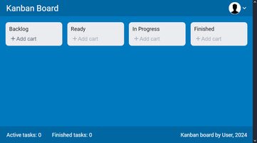

# KanbanBoard

Link: [baradzenka.github.io/KanbanBoard](https://baradzenka.github.io/KanbanBoard/)

The simple Kanban board. Create tasks in the Backlog and move them to the columns on the right. You can also set a description for each task.

HTML + SCSS + TypeScript + React are used.